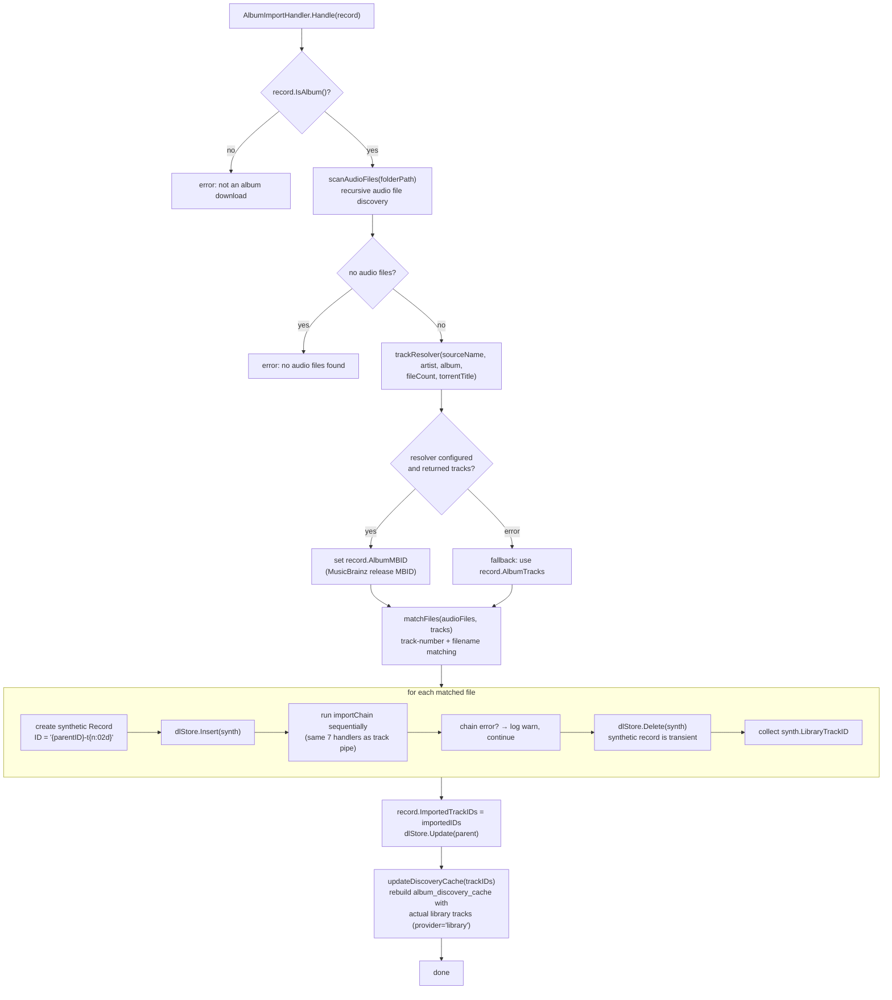

# Album Import Handler

> Source of truth: `internal/download/handler_album_import.go`.

`AlbumImportHandler` processes completed **album** downloads (torrents via
Prowlarr → qBittorrent, or any provider that reports a folder). It is invoked by
`CompletedDownloadService.onDownloadCompleted` when `record.IsAlbum()` is true.

## Flowchart

## Step Details (code-verified)

1. **`scanAudioFiles`** — recursively finds audio files in the downloaded
   folder (`record.FilePath` or `record.FolderPath`).
2. **`trackResolver`** — a function type wired in `cmd/groovearr/app.go`
   (`newTrackResolver`) bridging to Prowlarr's `ResolveTracksForCount`:
   `MusicBrainz.SearchReleasesByGroup(rgid)` → one API call returns all releases
   in the release group with track counts → `pickBestMatchingRelease` picks the
   release whose track count is closest to the file count (word-overlap
   tiebreaker with the torrent title, e.g. "Ten Redux" vs "Ten").
3. **`matchFiles`** — pairs filesystem files with expected tracks by track
   number + cleaned filename.
4. **Synthetic records** — each matched file becomes a transient `Record` with
   `ID = "{parentID}-t{index:02d}"`, `State = StateImporting`, and runs through
   the **same** 7-handler `importChain` as single-track downloads (see
   [import-handler-chain.md](import-handler-chain.md)). The chain sets
   `LibraryTrackID` during `LibraryImporterHandler.Handle()`.
5. **Cleanup** — synthetic records are deleted from the downloads store after
   the chain; they never appear in the downloads list.
6. **`updateDiscoveryCache`** — writes the actual library tracks under
   `provider_name = 'library'`, overriding stale discovery-provider data
   (e.g. 17-track "Ten Redux" instead of Deezer's 11-track standard edition).

## Key Facts

- Album import is **post-download** — track resolution happens only after the
  torrent completes, using the **actual file count** on disk.
- The parent record's `AlbumMBID` flows into the import chain via each
  synthetic record, enabling accurate cover art lookups (Cover Art Archive) and
  MBID sync to the library album.
- Synthetic per-track failures are logged but do not fail the parent album —
  the chain error on a single track is non-fatal; `importedIDs` collects
  whatever succeeded.
