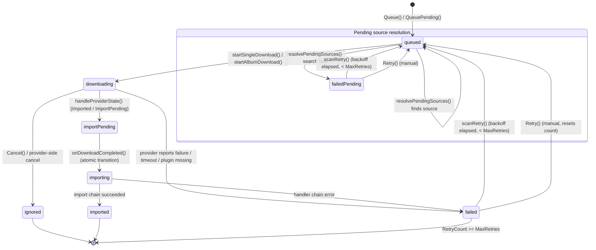

# Download State Machine

> Source of truth: `internal/download/types.go`, `internal/download/service.go`,
> `internal/download/monitor_dispatch.go`, `internal/download/monitor_retry.go`,
> `internal/download/importer.go`.

The download lifecycle is a state machine with **8 states**, driven by the
`MonitoringService` poll loop and the `CompletedDownloadService` import chain.
Transitions that cross a live boundary (dispatch, download→import handoff,
failure paths) are atomic via `store.TransitionState(id, oldState, newState)` —
a transition that no longer matches `oldState` (e.g. a concurrent cancel) is
rejected. Terminal transitions and the retry loop use plain `store.Update`.

## States

| State | Meaning | Terminal | Retryable |
|---|---|---|---|
| `queued` | Waiting for the monitor to pick it up | — | — |
| `downloading` | Provider actively transferring | — | — |
| `importPending` | File on disk, waiting for import chain | — | — |
| `importing` | Import handler chain running | — | — |
| `imported` | Fully imported into library | ✅ | — |
| `failedPending` | Source resolution failed (pending-source records) | — | ✅ |
| `failed` | Download/import failed | ✅ | ✅ |
| `ignored` | Cancelled (user or provider-side) | ✅ | — |

`MaxRetries = 5` caps automatic retry attempts.

## Flowchart

## Transition Notes (code-verified)

- **`Queue()`** — inserts `queued` with a resolved source, dedups by
  `FindActiveByTitle(artist, title)`, publishes `TopicDownloadQueued`.
- **`QueuePending()`** — inserts `queued` with `SourceName = "pending"`.
  The monitor skips these in `startQueuedDownloads`; `resolvePendingSources`
  resolves them. A failed resolution moves them to `failedPending` with
  `RetryCount = 1` and a 1-minute `RetryAfter`.
- **`queued → downloading`** — `startSingleDownload()` (track pipe, via
  `MonitoredProvider.StartDownload`) or `startAlbumDownload()` (album pipe, via
  `DownloadClient.AddDownload`). Both acquire a per-provider/per-client
  concurrency semaphore first; if the pool is full the record stays `queued`
  and is retried next tick.
- **`downloading → importPending`** — `handleProviderState()` when the provider
  reports `StateImported` (track pipe) or `StateImportPending` (album pipe).
  Publishes `TopicDownloadCompleted`.
- **`downloading → failed`** — provider reports failure, per-download timeout
  (`md.deadline` from `DownloadTimeout()`), or the plugin disappears from the
  registry.
- **`downloading → ignored`** — user `Cancel()` transitions the record to
  `ignored` **before** cancelling the provider (prevents duplicate cancels from
  `checkCancellations`). Provider-side `ignored` drops tracking without a
  state transition on the record.
- **`importPending → importing`** — `CompletedDownloadService.onDownloadCompleted`
  verifies state is still `importPending`, then atomically transitions.
- **`importing → imported`** — all handlers succeeded.
- **`importing → failed`** — any handler returns an error.
- **Retry** — `scanRetry()` re-queues `failed` + `failedPending` records whose
  `RetryAfter` has elapsed, with exponential backoff `2→4→8→16→32→60 min`
  ±20% jitter (`jitterBackoff`), capped at `MaxRetries`. Before re-queueing it
  searches all providers for an alternative source (`Orchestrator.FindBestMatch`);
  if none is found the record stays failed. Manual `Retry()` resets
  `RetryCount`/`RetryAfter` and transitions immediately.
