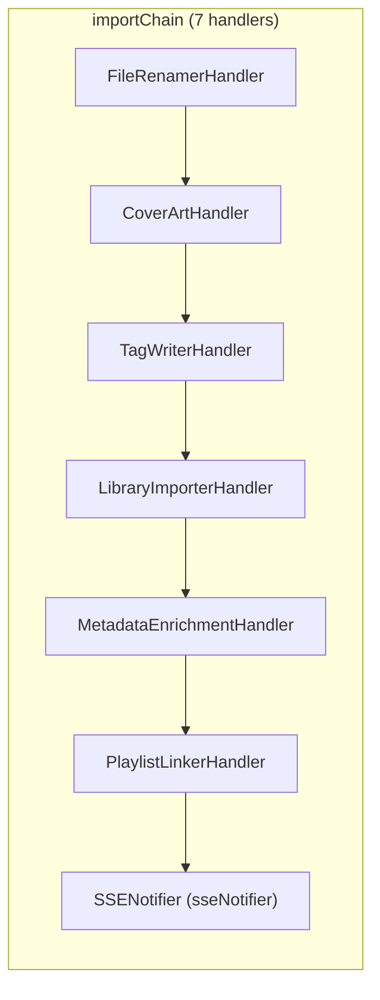
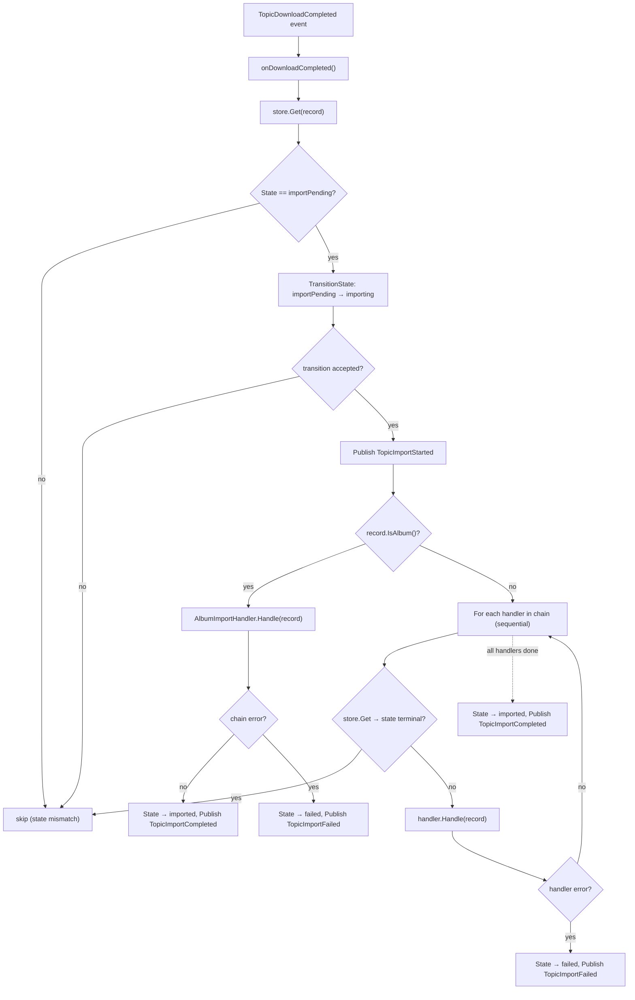

# Import Handler Chain

> Source of truth: `internal/download/importer.go`,
> `internal/download/handler_*.go`, `cmd/groovearr/app.go` (chain wiring, ~L233-250).

`CompletedDownloadService` subscribes to `TopicDownloadCompleted` and runs the
post-download import pipeline. Album downloads route through
`AlbumImportHandler` (which feeds per-track records through the **same** chain);
single-track downloads run the chain directly.

## Wiring (app.go)

## CompletedDownloadService Flow

### Key behaviors (code-verified)

- **Atomic transition** — `importPending → importing` via
  `TransitionState`; a concurrent cancel aborts the import.
- **Terminal-state re-check** — between every handler, the service re-reads the
  record; if it reached a terminal state (e.g. user cancelled mid-import), the
  chain aborts.
- **Album path** — `AlbumImportHandler` replaces the outer chain for the parent
  record; the per-track synthetic records it creates run through the *same*
  `importChain` (see [album-import-handler.md](album-import-handler.md)).
- **Failure** — the first handler error marks the record `failed`, persists it,
  and publishes `TopicImportFailed`; the remaining handlers are skipped.

## Handler Responsibilities

| # | Handler | File | Responsibility |
|---|---|---|---|
| 1 | `FileRenamerHandler` | `handler_renamer.go` | Move raw file from download staging into library path per `folder_template` |
| 2 | `CoverArtHandler` | `handler_cover.go` | Download album cover from `record.CoverURL` if missing; update `thumb_url` |
| 3 | `TagWriterHandler` | `handler_tagwriter.go` | Write ID3/FLAC tags to the file |
| 4 | `LibraryImporterHandler` | `handler_library.go` | Insert artist/album/track into SQLite library; set `LibraryTrackID` |
| 5 | `MetadataEnrichmentHandler` | `handler_enrichment.go` | Enrich via metadata providers; see [metadata-enrichment.md](metadata-enrichment.md) |
| 6 | `PlaylistLinkerHandler` | `handler_playlist.go` | Link imported track to its playlist (`playlist_id`); skip if none |
| 7 | `SSENotifier` | `internal/sse` | Broadcast import events to connected SSE clients |

> **Note (drift from old docs):** the enrichment handler runs at step **5** (after
> the library import) and the chain re-checks terminal state between handlers —
> neither is reflected in the ASCII diagram in `docs/architecture.md`.
