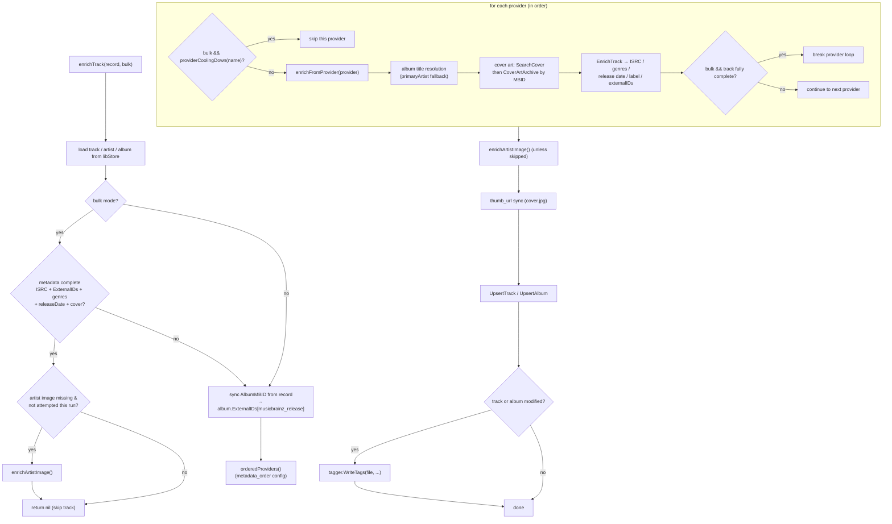
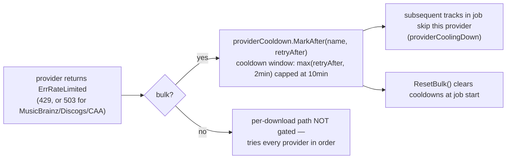

# Metadata Enrichment

> Source of truth: `internal/download/handler_enrichment.go`,
> `internal/metadata/provider.go`, `internal/metadata/cooldown.go`,
> `cmd/groovearr/app.go` (provider cooldown + order wiring).

`MetadataEnrichmentHandler` (import chain step 5, and the bulk library job) runs
registered metadata providers against a library track. It resolves album titles,
downloads cover art and artist images, and enriches tracks with ISRC, genres,
release date, label, and external IDs (MusicBrainz MBIDs, etc.).

## Provider Loop

## Rate Limiting & Provider Cooldown

## Provider Order

- Configurable via `metadata_order` in config.json
  (`{"metadata_order": ["deezer", "musicbrainz", "coverartarchive"]}`).
- Deezer first (fast, 50 req/5s, better album resolution). Falls through to
  MusicBrainz (1 req/s, deep catalog). Cover Art Archive last (MBID-based only).
- Unlisted providers sort to the end.

## Bulk vs Per-Download (code-verified)

| Behavior | Bulk library job (`bulk=true`) | Per-download (import chain) |
|---|---|---|
| Skip already-complete tracks | ✅ (metadata + cover present) | ❌ always runs |
| Cooldown-gated providers | ✅ skip cooling-down providers | ❌ runs every provider |
| Stop early once complete | ✅ break after first full provider | ❌ runs all providers (keeps MBIDs, label) |
| Artist image | once per artist per run (`bulkArtists` dedup) | always refreshes |
| Cooldown reset | `ResetBulk()` at job start | — |

## Key Facts

- **Shared cooldown** — one `metadata.ProviderCooldown` instance is created in
  `app.go` and wired into both the API server and the enrichment handler, so a
  rate limit observed by any consumer cools the provider app-wide briefly.
- **Spotify fail-fast** — `handleRateLimit` retries short `Retry-After` values
  (≤5s) with context-aware sleep; a long Retry-After fails fast with
  `ErrRateLimited` rather than blocking a worker (the enrichment convoy stall
  fix).
- **`primaryArtist`** — strips featured/collaboration artists from comma-
  separated Spotify co-artist strings for fallback searches.
- **Re-tag** — files are re-tagged only when track or album metadata changed.
