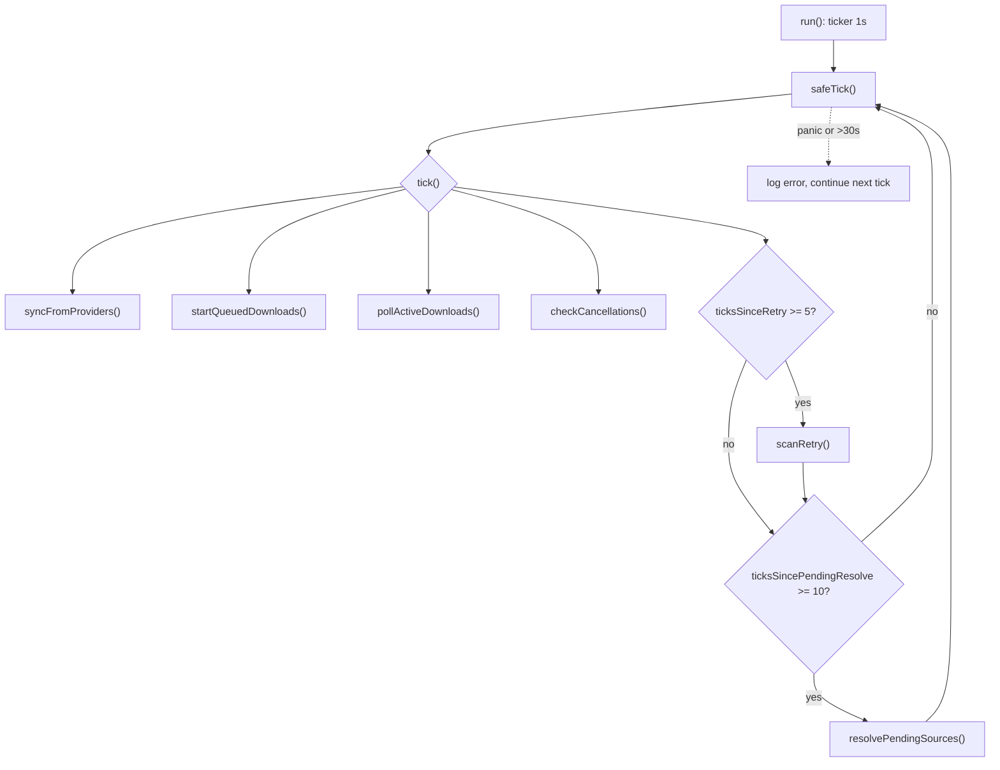
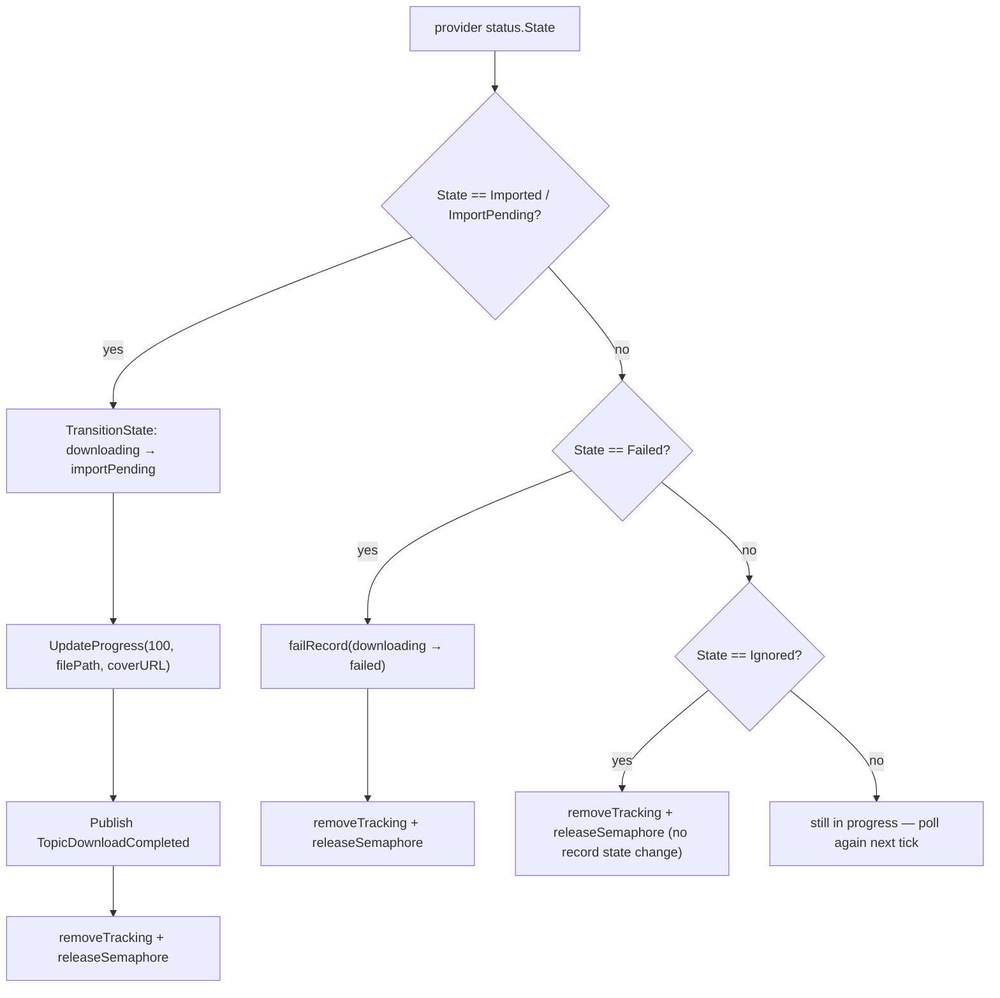
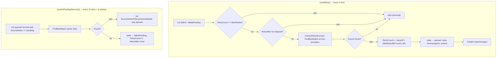

# Monitoring Service

> Source of truth: `internal/download/monitor_core.go`,
> `internal/download/monitor_dispatch.go`, `internal/download/monitor_retry.go`.

`MonitoringService` drives the download state machine from a single ticker loop.
It replaces the older worker-pool/dispatcher/retry-worker design: one goroutine,
1-second poll interval, each tick wrapped in panic recovery and a 30s watchdog.

## Main Loop

- **`safeTick()`** runs each tick in a goroutine with a 30s `time.After` watchdog:
  a hung provider HTTP call never blocks the monitor indefinitely.
- **`run()`** starts after `Start()`: orphan recovery + pending-source resolution
  run first, then the poll loop starts. `Shutdown()` cancels the internal context
  and waits for the loop to exit; active downloads are **not** cancelled.

## Tick Phases

```mermaid
flowchart TD
    subgraph sync["syncFromProviders() — orphan reconciliation"]
        A1["For each registered MonitoredProvider"]
        A2["Get ActiveDownloads() (provider-managed IDs)"]
        A1 --> A2
        A2 --> A3{"Provider ID known to us?"}
        A3 -- yes --> A4["keep tracking"]
        A3 -- no --> A5["GetStatus() to match → adopt as groovearr record"]
        A2 --> A6{"Tracked ID missing from ActiveDownloads?"}
        A6 -- yes --> A7["assume provider cleaned up → remove tracking"]
    end

    subgraph start["startQueuedDownloads() — dispatch"]
        B1["List queued records"]
        B1 --> B2{"Already tracked?"}
        B2 -- yes --> B3["skip"]
        B2 -- no --> B4{"IsPendingSource()?"}
        B4 -- yes --> B3
        B4 -- no --> B5{"Non-album with empty Filename?"}
        B5 -- yes --> B3
        B5 -- no --> B6{"RetryAfter not elapsed?"}
        B6 -- yes --> B3
        B6 -- no --> B7{"Record is album?"}
        B7 -- yes --> B8["startAlbumDownload() → DownloadClientRegistry"]
        B7 -- no --> B9["startSingleDownload() → MonitoredProvider"]
    end

    subgraph poll["pollActiveDownloads() — status polling"]
        C1["For each active download"]
        C1 --> C2{"Deadline passed?"}
        C2 -- yes --> C3["failRecord(downloading → failed)"]
        C2 -- no --> C4{"Album download?"}
        C4 -- yes --> C5["pollAlbumDownload() → DownloadClient"]
        C4 -- no --> C6["GetStatus() + GetProgress() via MonitoredProvider"]
        C6 --> C7["UpdateProgress() + fire progress event"]
        C7 --> C8["handleProviderState()"]
    end

    subgraph check["checkCancellations()"]
        D1["Detect records cancelled externally → issue provider Cancel"]
    end
```

## handleProviderState (terminal states from provider)

## Retry & Pending Resolution (every N ticks)

## Key Facts

- **`syncFromProviders()`** (undocumented in the old ASCII docs): reconciles
  the provider's `ActiveDownloads()` against our tracking map every tick —
  adopts unknown provider IDs by matching `GetStatus()`, drops tracking for IDs
  the provider no longer reports.
- **Concurrency** — per-plugin/per-client semaphores (buffered channels) gate
  dispatch. A full pool leaves records `queued` for the next tick.
- **Timeouts** — per-download deadline = `now + DownloadTimeout()`; enforced in
  `pollSingle`/`pollAlbumDownload` before status polling.
