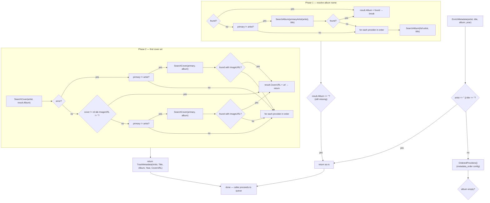

# Queue-Time Metadata Resolution

> Source of truth: `internal/metadata/resolver.go` (`MetadataResolver.EnrichMetadata`).

`MetadataResolver.EnrichMetadata` completes **partial** track metadata at queue
time — before a download is queued — by querying configured metadata providers
in priority order (`metadata_order` config). It resolves a missing album name,
then finds cover art.

It is **non-fatal and best-effort**: provider errors are logged at warn level
and enrichment failures leave fields empty rather than blocking the queue
pipeline. Unlike the post-import [Metadata Enrichment](metadata-enrichment.md)
handler, it is **not** gated by `ProviderCooldown`.

## Flowchart

## Behavior Summary (code-verified)

| Aspect | Behavior |
|---|---|
| Failure mode | Non-fatal. Errors logged `warn`, empty fields, never blocks queue |
| Phase 1 (album) | Skips album lookup if `album` already non-empty |
| Phase 1 fallback | Full artist first, then `primaryArtist(artist)` (before first comma / `&` / `feat.` / `vs.` / `x`) |
| Phase 2 (cover) | Runs only if album resolved; returns on first `ImageURL` hit |
| Phase 2 fallback | Full artist first, then primary artist — per provider |
| Cooldown gating | **None** — every provider is tried on every queue |
| `primaryArtist()` | Strips collaboration suffixes; normalizes `\u00a0` (non-breaking space) in metadata |

## Relationship to Post-Import Enrichment

Queue-time resolution is the **cheap pre-queue pass** (`MetadataResolver`). The
post-import [Metadata Enrichment](metadata-enrichment.md) handler (import chain
step 5) is the **deep pass** that fills ISRC, genres, release date, label,
external IDs, artist images, and MBID sync after the file is in the library.
Both share `OrderedProviders()` ordering and the `primaryArtist` fallback, but
only the post-import handler is cooldown-gated.
