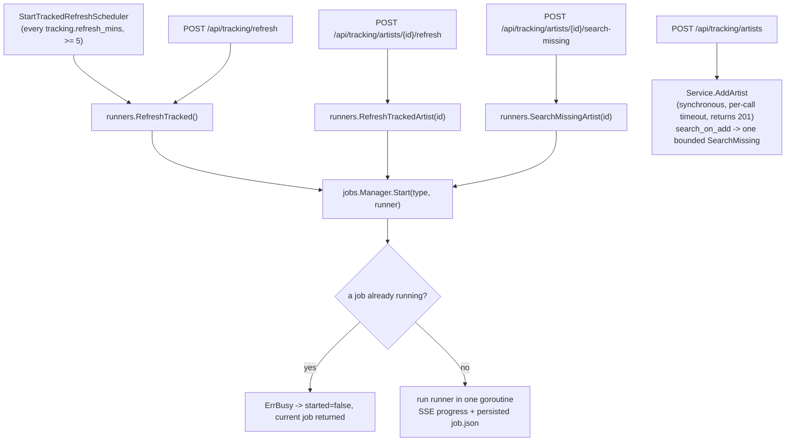
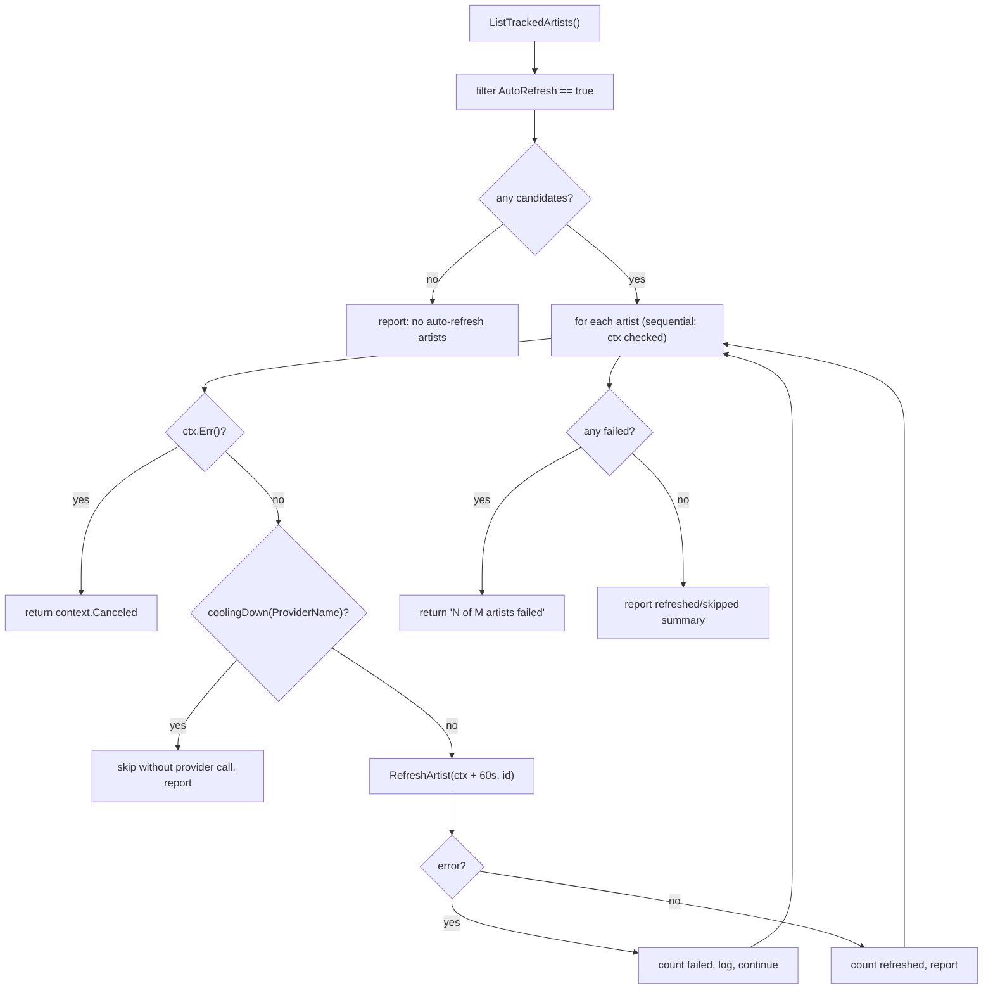
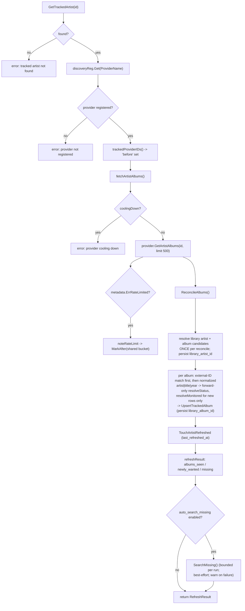
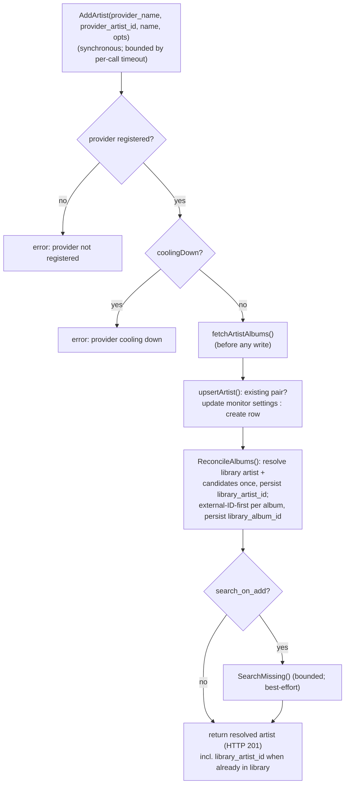
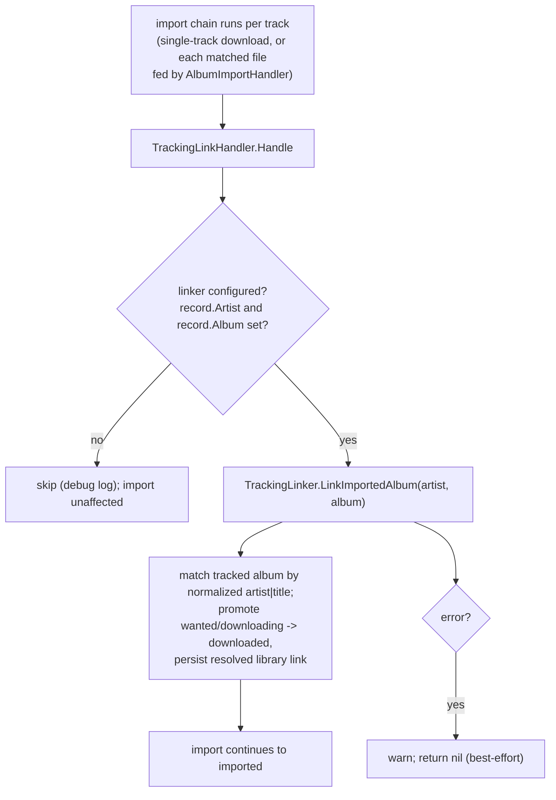
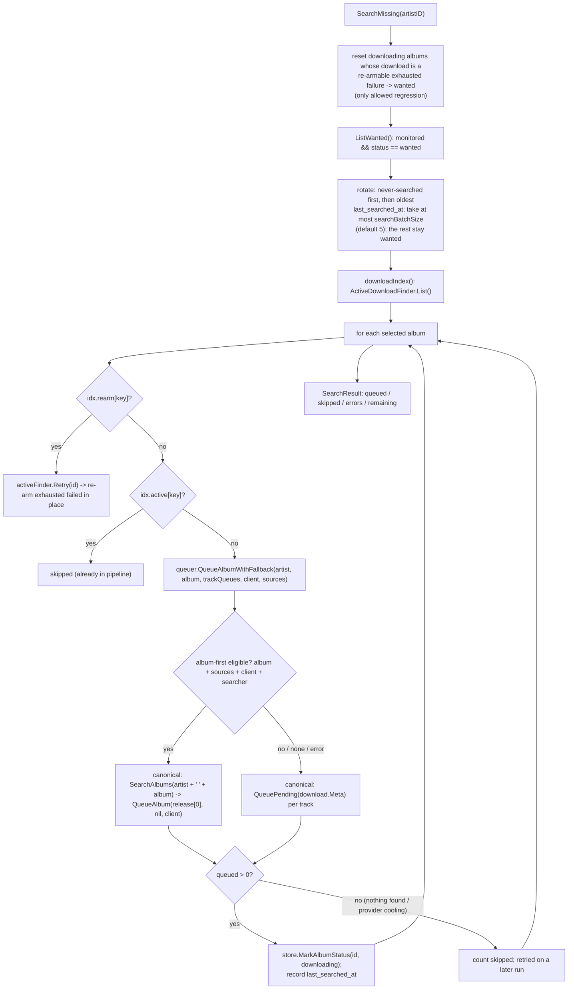

# Tracking Refresh & Search-Missing

> Source of truth: `internal/tracking/service_search.go`,
> `internal/tracking/service_reconcile.go`, `internal/jobs/tracked.go`,
> `internal/jobs/manager.go`, `internal/api/handlers_tracking.go`,
> `internal/tracking/sqlite/store.go`, `internal/download/album_queue.go`,
> `internal/download/handler_tracking.go`, `cmd/groovearr/app.go`.

Artist tracking keeps a provider discography in sync with the local library,
then queues what is missing. Every provider-calling path except `AddArtist`
runs as a **job** through the shared `jobs.Manager` (single-flight,
cancellable, SSE progress, persisted) — the HTTP handlers only pick a runner.
`AddArtist` runs synchronously; with `search_on_add` it also triggers one
bounded `SearchMissing` inline after the reconcile.

## Entry Points

- The scheduler (`Server.StartTrackedRefreshScheduler`) calls
  `jobs.Manager.Start` directly and **skips** a busy tick (logged, never
  queued); the HTTP path returns `{job, started:false}` instead.
- The scheduler loop selects on `ctx.Done()` and blocks nothing at shutdown.

## Scheduled / Bulk Refresh (`RefreshTracked`)

`RefreshTrackedArtist(id)` is the single-artist counterpart: it resolves the
artist through `GetTrackedArtist` (to read `ProviderName` for the cooling-down
pre-filter), skips a cooling provider, gives the refresh its own
`trackedArtistRefreshTimeout` (60s), and returns the wrapped error on failure.

## `RefreshArtist` — Fetch, Reconcile, Auto-Search

## `AddArtist` — Synchronous Reconcile

Idempotent: an existing provider pair is reconciled **in place** (monitor
settings updated, discography refreshed), never duplicated. The discography is
fetched **before** the artist row is written, so a provider timeout leaves no
tracked artist behind. The response is the resolved artist — including
`library_artist_id` when the artist is already in the local library.
`AutoRefresh` is applied only at creation — the store has no standalone
updater for it.

Adding an artist only **builds the wanted list** by default. `search_on_add`
(optional, default `false`) makes the request also run one `SearchMissing`
immediately after the reconcile — Lidarr's *Start Search for Missing Albums*.
Even then the search is bounded per run (see below). With the default, albums
are queued later by a manual Search Missing, the `tracked-search` job, or the
periodic refresh when `tracking.auto_search_missing` is enabled.

## Import-Driven Promotion (`TrackingLinkHandler`)

Tracking is also advanced by the **import chain**, not only by refresh: when a
completed download is imported, the chain promotes the matching tracked album
to `downloaded` immediately instead of waiting for the next reconcile/refresh.

- **Chain handler, not a new flow**: `TrackingLinkHandler`
  (`internal/download/handler_tracking.go`) is an `ImportHandler` appended to
  the standard chain in `cmd/groovearr/app.go`, after
  `NewLibraryImporterHandler` so the library rows exist first. It mirrors
  `PlaylistLinkerHandler` in shape but depends on a locally-declared
  `TrackingLinker` interface (`LinkImportedAlbum`), which `*tracking.Service`
  satisfies — the download package does not import `internal/tracking`.
- **Covers both download shapes**: single-track records run the chain directly;
  `AlbumImportHandler` feeds each matched file through the *same* chain as a
  synthetic per-track record carrying `Artist`/`Album`, so album imports get
  the promotion too (called once per track; `LinkImportedAlbum` is idempotent —
  already-`downloaded`/`ignored` albums are skipped).
- **Best-effort**: tracking is a side ledger, so a `LinkImportedAlbum` failure
  is logged at warn and `Handle` returns `nil`. Unlike `PlaylistLinkerHandler`,
  a tracking-link failure must never fail the import; the next reconcile/
  refresh would promote the album anyway.
- **No new download flow**: this is a chain step only. It does not change the
  state machine, the monitor, or `internal/tracking`; the tracking service's
  `LinkImportedAlbum` is the same matcher reconcile uses.

### Monitor-mode and status rules (`reconcileAlbum`)

- Library match: external ID first (`GetAlbumByExternalID`), then normalized
  `artist|title|year` against the library artist's albums. Matching only
  **reads** the library.
- **Resolved once per reconcile**: `ReconcileAlbums` resolves the library
  artist link and loads that artist's album candidates once, then reuses the
  set for every discovered album — no per-album artist/candidate lookup. The
  library artist's albums are still consulted through `GetAlbumByExternalID`
  once per album by design (external-ID lookup per album remains). The resolved
  `library_artist_id` is persisted on the tracked artist; a matched
  `library_album_id` is persisted on the tracked album.
- **`resolveStatus` — forward-only**: a `wanted` album whose library match is
  found is promoted to `downloaded`; an existing `downloaded` or `ignored`
  album is terminal and never regresses; a brand-new row starts `wanted`. The
  sole regression is the `downloading` → `wanted` failure requeue in
  `SearchMissing` (not in reconcile).
- **`resolveMonitored` — insert-time only**: a new album gets `monitored` from
  the artist's `monitor_mode` (`none` never; `future` only releases dated after
  the current year; `all`/unset everything). An existing album always keeps its
  own `monitored` flag — the background refresh never changes it, so a user's
  per-album toggle survives every refresh.

### Applying `monitor_mode` to existing albums

`monitor_mode` reaches existing albums only through the explicit **Set Artist
Monitor** action — `PATCH /api/tracking/artists/{id}` — never through refresh:

- `none` — unmonitor the artist's albums, except albums whose status is
  `ignored` (they keep their explicit skip).
- `all` — re-monitor them.
- `future` — monitor only releases with `year >` the current year.

## `SearchMissing` — Queue Path

- **Album-first, track fallback** is the shared canonical album-acquisition
  policy and lives **only** in
  `download.Service.QueueAlbumWithFallback` (`internal/download/album_queue.go`).
  Both the discover album-download handler
  (`POST /api/discover/albums/{id}/download`) and tracking `SearchMissing`
  call that one method — no second copy of the policy exists. The diagram's
  `H1`–`H3` steps are the policy's internal legs, owned by
  `internal/download/album_queue.go`: when album-first is eligible it does
  `SearchAlbums(artist + ' ' + album)` → `download.Service.QueueAlbum(release[0], …)`;
  otherwise (not eligible / no releases / search error) it falls back to
  per-track `download.Service.QueuePending`, resolved later by the monitor.
  The tracking service builds `[]download.TrackQueue` from the resolved
  discovery tracklist and passes it in; it never branches on album-vs-track
  itself.
- **Bounded and rotating per run**: at most `searchBatchSize` wanted albums
  (default 5) are selected per pass, ordered **never-searched first, then oldest
  `last_searched_at` first**; the rest stay `wanted`. `Remaining` in the
  `SearchResult` reports how many were left after the cap, and the next run
  continues with them. An album that cannot be queued this pass (nothing found,
  or its provider is cooling down) is counted as `skipped` and retried on a
  later run — it no longer blocks the albums behind it. This keeps a first
  search on a deep discography from dumping hundreds of albums into the queue
  at once. Nothing is dropped or double-queued — the cap only defers.
- **Failure requeue**: a tracked album stuck in `downloading` whose download is
  a re-armable exhausted failure is reset to `wanted` and retried.
  `downloading` → `wanted` is the only allowed status regression; reconcile
  still never regresses `downloaded` or `ignored`.
- **Dedup / re-arm**: `QueueAlbum`/`QueuePending` dedup internally;
  `ActiveDownloadFinder` is an extra pre-filter. An exhausted-failed record
  (`RetryCount >= MaxRetries`, state `failed`/`failedPending`) is re-armed in
  place via `Retry` once it has sat failed for `requeueCooldown` (24h) — no
  duplicate record.
- **Dedup key**: index keys are
  `lower(trim(artist)) + "|" + lower(trim(title))`. Album-level records use the
  album title as `Title`, so they key as `artist|album`; the per-track fallback
  records key as `artist|track-title`. The two key spaces do **not** overlap —
  an album key never matches its own per-track records. Consequence: when only
  per-track records are pending, the album still looks absent to the
  pre-filter, so `SearchMissing` re-runs the album search for it on each pass
  (bounded churn: at most one search per wanted album per run). Literal
  duplicate download records are still prevented by `QueueAlbum` /
  `QueuePending`'s own dedup.

## Status Transitions

| Status | Set by |
|---|---|
| `wanted` | new reconciled release with no library match; also the requeue reset of a `downloading` album whose download is a re-armable exhausted failure |
| `downloading` | `SearchMissing` after a successful queue (`MarkAlbumStatus`) |
| `downloaded` | reconcile promotes a `wanted` album to `downloaded` on a library match; the import chain (`TrackingLinkHandler` → `LinkImportedAlbum`) also promotes immediately when the download is imported (forward-only; terminal — never regresses) |
| `ignored` | explicit user skip via the per-album PATCH `status` field; terminal — cleared only by setting `status: "wanted"` |

Status is **forward-only except one requeue**: reconcile only ever promotes
`wanted` → `downloaded`, but a `downloading` album with a re-armable exhausted
failure is reset to `wanted` (`downloading` → `wanted` is the only allowed
regression). `downloaded` and `ignored` never regress. The only writer of
`ignored` is `PATCH /api/tracking/albums/{albumID}` with `status: "ignored"`;
the refresh path never writes it.

`RefreshResult` reports `albums_seen`, `newly_wanted`, `missing`;
`SearchResult` reports `queued`, `skipped`, `errors`, `remaining`.

## Shared Cooldown (AGENTS §8)

- Job runners pre-filter with `RateLimit.CoolingDown(provider)` and skip the
  artist without a provider call.
- `fetchArtistAlbums` also checks `coolingDown` and, on
  `metadata.ErrRateLimited`, calls `noteRateLimit` → `MarkAfter(name,
  retryAfter)` on the **same shared** `metadata.ProviderCooldown`.
- `albumTracks` skips a cooling provider.
- One bucket app-wide: a 429 seen by an artist refresh parks the provider for
  enrichment, search, health checks, and every other job too.

## Key Facts

- **Single-flight**: `jobs.Manager.Start` allows one running job at a time and
  returns `ErrBusy` otherwise. API returns `{job, started:false}` (200); the
  scheduler logs and skips the tick.
- **Scheduled refresh**: enabled when `tracking.refresh_mins >= 5`
  (default 720 = 12h); `nil`/`0` disables it.
- **Per-artist budget**: `trackedArtistRefreshTimeout` = 60s. A per-artist
  timeout counts as that artist's failure and the bulk run continues; a parent
  cancellation returns `context.Canceled`.
- **AddArtist budget**: `AddArtist` is synchronous but bounded by a per-call
  timeout. It fetches the discography **before** writing the artist row, so a
  provider timeout fails the request and leaves no tracked artist behind. It
  does not run as a job.
- **Search on add**: `POST /api/tracking/artists` with `search_on_add:true` runs
  one bounded `SearchMissing` after the synchronous reconcile; the default
  (`false`) only builds the wanted list. The search never bypasses the per-run
  batch cap.
- **Persistence**: tracking tables live in the library SQLite DB —
  `internal/tracking/sqlite` wraps the shared `*sql.DB` and re-asserts
  `PRAGMA foreign_keys = ON` so `tracked_albums`' `ON DELETE CASCADE` fires.
  `ReconcileAlbums` writes `last_refreshed_at` via `TouchArtistRefreshed`, the
  resolved `library_artist_id` on the tracked artist, and `library_album_id` on
  each matched album.
- **Monitor mode**: `monitor_mode` is applied to existing albums only by the
  Set Artist Monitor action (`PATCH /api/tracking/artists/{id}`); the background
  refresh never rewrites `monitored` on an existing album.
- **No goroutines** are spawned by runners; `ctx` is observed between artists.
